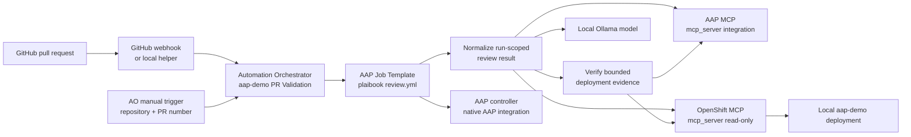

# ADR-024: Isolate AO pull-request testing in its own addon

- Status: Accepted
- Date: 2026-09-17
- Deciders: aap-demo maintainers

## Context

The core `ao` addon installs and wires Automation Orchestrator and its baseline
local integrations. Pull-request validation has a different lifecycle and
security boundary: it needs a PR webhook or manual PR input, a read-only view
of the local OpenShift deployment, and a governed checkout/review path.

The review itself should be delegated to the Ansible plaibook maintained in
AAP rather than reproduced in AO agent nodes. AO can launch AAP job templates,
and the local OpenShift MCP server can provide bounded deployment evidence.

## Decision

Create a separate `ao-pr-testing` addon that requires AO but is not installed
by the core `ao` addon.

The addon owns:

1. A read-only OpenShift MCP Helm release in the `openshift-mcp-server`
   namespace.
2. An AO integration for that MCP endpoint with no external management
   credential; the MCP server uses its bound ServiceAccount. The workflow
   receives a separate short-lived AO bearer credential minted from that
   ServiceAccount so AO can bind the integration to agentic nodes.
3. An AAP Project and Job Template for
   `https://github.com/aknochow/ansible-plaibook.git`, synchronized on launch
   and executed with the shared `quay.io/cferman/plaibook-ee:latest` image.
   The playbook receives `review_type=pr`, `post_results=false`, and a runtime
   `review_targets_raw` value of `owner/repository#pull_request_number`.
4. An AO workflow named `aap-demo PR Validation` with:
   - a webhook trigger at `aap-demo-pr-validation`;
   - a manual PR-input trigger;
   - an AAP Job Template node that launches plaibook's `review.yml`;
   - a small result-normalization stage; and
   - an AAP/OpenShift-only verification stage that checks only evidence
     supported by the local deployment.
5. A public AAP execution environment registration for
   `quay.io/cferman/plaibook-ee:latest`, managed idempotently by the addon so
   PR-related AAP job templates can use the shared image without a registry
   credential. The image name and EE name are overrideable through
   `AO_PR_TESTING_EE_IMAGE` and `AO_PR_TESTING_EE_NAME`.

The plaibook AAP Job Template receives a dedicated custom AAP credential whose
service account can only `get` the configured OpenShell TLS Secret. This direct
Kubernetes API path is limited to sandbox bootstrap; AO agentic stages still
use the read-only OpenShift MCP integration for deployment evidence. The addon
requires the OpenShell namespace and TLS Secret to exist before deployment and
does not weaken sandboxing when they are absent.

Public PR retrieval is performed by plaibook from the AAP Job Template, so the
addon does not provision a GitHub MCP integration or copy a local GitHub token
into AO. Private-repository credentials are an explicit future configuration
concern.

The OpenShift MCP server is configured with the core toolset, read-only
behavior, destructive-operation protection, denied Secret/ConfigMap/RBAC
resources, and the read-only view ClusterRole. Missing PR data, checkout,
sandbox, runner, or permission must be reported as `blocked` rather than
claiming a pass.

The existing AO addon remains unchanged apart from addon discovery and
documentation.

## Implementation and test notes

The implementation provisions the following AAP resources idempotently:

- execution environment `plaibook-ee`, using the public
  `quay.io/cferman/plaibook-ee:latest` image;
- project `aap-demo Plaibook Review`, synchronized from the plaibook
  repository; and
- Job Template `aap-demo | Plaibook PR Review` running `review.yml`.

The native `aap_job_template` node must receive the
`ansible_automation_platform` integration (`aap-demo AAP`) and its credential.
The later agentic nodes must receive only `mcp_server` integrations: the AAP
MCP integration (`aap-demo MCP Server`) and the read-only OpenShift MCP
integration. AO's workflow validator does not catch a missing or mistyped
native-node binding, so the addon publishes only after these bindings are
present in the generated definition.

The first end-to-end PR 137 test reached AO but exposed these wiring issues in
sequence: the native node initially had no AAP binding, then it was given the
MCP integration type, and finally the agentic nodes were given the AAP
integration type. These were corrected before the current test iteration.
The first AAP job then reached `review.yml` and failed because the EE omitted
`aknochow.cursor`, which supplies `aknochow.cursor.bridge`; that collection is
now included in the EE build alongside the OpenAI, Claude, OpenShell, and
Kubernetes collections. A PR test is not considered complete until the rebuilt
EE is pushed and the run-scoped plaibook result is available.

Sandboxing remains enabled by default. A missing OpenShell gateway, TLS
secret, auth bridge, checkout, or run-scoped result is a blocked validation,
not a reason to disable isolation. Deployment also fails early when the
configured OpenShell namespace or TLS Secret is absent.

## Architecture

The expensive and source-sensitive work is owned by the AAP plaibook Job
Template. AO agentic nodes receive only the run-scoped result and the small
AAP/read-only OpenShift tool set needed for normalization and verification.
This keeps the local model context bounded and makes the AAP job the governed
checkout/review boundary. The original portal/APME credential file is not
mounted into the cluster.

## Consequences

### Positive

- AO installation stays focused and has no PR-testing-specific dependencies.
- The review implementation, checkout, and diff handling are owned by
  plaibook and run under AAP governance.
- Public PRs do not require an additional GitHub MCP integration or copied
  local token.
- OpenShift access is least-privilege and read-only by default.
- Webhook and manual execution support the same workflow definition.

### Trade-offs

- The addon requires AO, Ollama, Helm, AAP, and a reachable local OpenShift
  route.
- A GitHub-hosted webhook needs a tunnel or relay to reach a local deployment.
- Complete PR execution still requires a usable plaibook sandbox and
  PR-specific test runner; until those are available, the workflow must return
  blocked for unavailable checks.
- The addon warms the configured Ollama model before execution. AO controls
  the Task Agent timeout at the platform level, so a larger or faster local
  model may still be required for reliable tool calling.
- The OpenShift MCP server is a preview technology and adds another image and
  namespace to the local cluster.

## Alternatives considered

### Add PR testing to `ao`

Rejected. It couples optional testing behavior to the AO installation path and
makes the core addon responsible for PR-specific concerns.

### Keep using kubectl from the workflow

Rejected. The workflow should interact with the deployment through an
OpenShift MCP integration so tool use is visible to AO, constrained by RBAC,
and available to the agent without embedding shell access.

### Reuse the APME/portal Kubernetes secret directly

Rejected. Public PRs do not need the local GitHub token, and private-repository
credential wiring should be explicit rather than copied implicitly by this
addon.

## References

- [OpenShift MCP server documentation](https://docs.redhat.com/en/documentation/openshift_container_platform/4.22/html/ai_applications/mcp-server)
- [ansible-plaibook](https://github.com/aknochow/ansible-plaibook)
