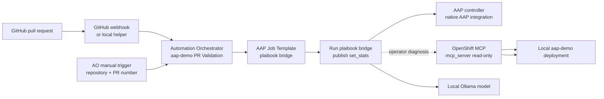

# ADR-024: Isolate AO pull-request testing in its own addon

- Status: Accepted
- Date: 2026-09-17
- Deciders: aap-demo maintainers

## Context

The core `ao` addon installs and wires Automation Orchestrator and its baseline
local integrations. Pull-request validation has a different lifecycle and
security boundary: it needs a PR webhook or manual PR input, a read-only view
of the local OpenShift deployment, and a governed checkout/review path.

The review itself should be delegated to the Ansible plaibook maintained in
AAP rather than reproduced in AO agent nodes. AO can launch AAP job templates,
and the local OpenShift MCP server can provide bounded deployment evidence.

## Decision

Create a separate `ao-pr-testing` addon that requires AO but is not installed
by the core `ao` addon.

The addon owns:

1. A read-only OpenShift MCP Helm release in the `openshift-mcp-server`
   namespace.
2. An AO integration for that MCP endpoint with no external management
   credential; the MCP server uses its bound ServiceAccount. The workflow
   keeps a separate short-lived AO bearer credential minted from that
   ServiceAccount for explicit operator-led MCP inspection.
3. An AAP Project and Job Template for the local plaibook-result bridge,
   synchronized on launch and executed with the shared
   `quay.io/cferman/plaibook-ee:latest` image. The bridge fetches the public
   `https://github.com/aknochow/ansible-plaibook.git` source at runtime,
   invokes its `review.yml`, reads the run-scoped JSON summary, and publishes
   the result through Ansible `set_stats`. The review receives
   `review_type=pr`, `post_results=false`, and a runtime `review_targets_raw`
   value of `owner/repository#pull_request_number`.
4. An AO workflow named `aap-demo PR Validation` with:
   - a webhook trigger at `aap-demo-pr-validation`;
   - a manual PR-input trigger;
   - one terminal AAP Job Template node that launches the bridge and exposes
     deterministic `artifacts` for the review and live smoke test.
5. A public AAP execution environment registration for
   `quay.io/cferman/plaibook-ee:latest`, managed idempotently by the addon so
   PR-related AAP job templates can use the shared image without a registry
   credential. The image name and EE name are overrideable through
   `AO_PR_TESTING_EE_IMAGE` and `AO_PR_TESTING_EE_NAME`.

The plaibook AAP Job Template deliberately runs sandboxless in this dev
profile. Each run uses the ephemeral AAP execution environment, and OpenShell
is not deployed, configured, or exposed as an addon option. A separate
production-oriented review deployment must provide the stronger per-review
sandbox boundary.

The optional plaibook exploration pass is disabled in this dev profile. The
deterministic checklist and model-backed review lenses remain enabled. The
bridge publishes both the run-scoped review JSON and route-level smoke checks
for the live AAP and Automation Orchestrator endpoints through `set_stats`.
The terminal AO node therefore has a deterministic `artifacts` contract; it
does not rely on an agentic normalizer or verifier to reinterpret AAP output.
The read-only OpenShift MCP remains available for operator-led inspection and
diagnosis, but it is not used as a flaky model-mediated pass/fail gate.

Public PR retrieval is performed by plaibook from the AAP Job Template, so the
addon does not provision a GitHub MCP integration or copy a local GitHub token
into AO. Private-repository credentials are an explicit future configuration
concern.

The OpenShift MCP server is configured with the core toolset, read-only
behavior, destructive-operation protection, denied Secret/ConfigMap/RBAC
resources, and the read-only view ClusterRole. Missing PR data, checkout,
sandbox, runner, or permission must be reported as `blocked` rather than
claiming a pass.

The existing AO addon remains unchanged apart from addon discovery and
documentation.

## Implementation and test notes

The implementation provisions the following AAP resources idempotently:

- execution environment `plaibook-ee`, using the public
  `quay.io/cferman/plaibook-ee:latest` image;
- project `aap-demo Plaibook Review`, synchronized from the aap-demo bridge
  repository; and
- Job Template `aap-demo | Plaibook PR Review` running
  `addons/ao-pr-testing/playbooks/plaibook-review-bridge.yml`.

The native `aap_job_template` node must receive the
`ansible_automation_platform` integration (`aap-demo AAP`) and its credential.
There are no downstream agentic nodes in the critical path. AO's workflow
validator does not catch a missing or mistyped native-node binding, so the
addon publishes only after this binding is present in the generated
definition.

The first end-to-end PR 137 test reached AO but exposed these wiring issues in
sequence: the native node initially had no AAP binding, then it was given the
MCP integration type, and finally the agentic nodes were given the AAP
integration type. These were corrected before replacing the agentic stages
with the bridge's deterministic artifact handoff.
The first AAP job then reached `review.yml` and failed because the EE omitted
`aknochow.cursor`, which supplies `aknochow.cursor.bridge`; that collection is
now included in the EE build alongside the OpenAI, Claude, OpenShell, and
Kubernetes collections. A PR test is not considered complete until the rebuilt
EE is pushed and the run-scoped plaibook result is available.

The dev profile intentionally runs without an OpenShell sandbox. Missing
checkout, runner, permission, or run-scoped result remains blocked; the AAP EE
is the execution boundary for this local-only workflow.

## Architecture

The expensive and source-sensitive work is owned by the AAP plaibook bridge
Job Template. It keeps the local model context and GitHub checkout inside the
governed AAP EE, then exposes a small structured result to AO through
`artifacts`. The original portal/APME credential file is not mounted into the
cluster. The OpenShift MCP remains a separate, read-only diagnostic surface.

## Consequences

### Positive

- AO installation stays focused and has no PR-testing-specific dependencies.
- The review implementation, checkout, and diff handling are owned by
  plaibook and run under AAP governance.
- Public PRs do not require an additional GitHub MCP integration or copied
  local token.
- OpenShift access is least-privilege and read-only by default.
- Webhook and manual execution support the same workflow definition.

### Trade-offs

- The addon requires AO, Ollama, Helm, AAP, and a reachable local OpenShift
  route.
- A GitHub-hosted webhook needs a tunnel or relay to reach a local deployment.
- The dev workflow uses the ephemeral AAP EE instead of a per-review sandbox;
  this is suitable for local testing but not for a shared or production review
  service.
- The addon warms the configured Ollama model before execution. AO controls
  the Task Agent timeout at the platform level, so a larger or faster local
  model may still be required for reliable tool calling.
- The dev profile skips plaibook exploration because the small local model can
  emit malformed search tool calls; plaibook correctly fails closed when that
  happens. The deterministic checklist, review lenses, and live route smoke
  checks remain in the workflow.
- The bridge smoke test is intentionally route-level: it proves that the live
  AAP and AO entry points respond from the review EE, while deeper cluster
  inspection remains an explicit OpenShift MCP operation.
- The OpenShift MCP server is a preview technology and adds another image and
  namespace to the local cluster.

## Alternatives considered

### Run plaibook sandboxless in the dev EE

Accepted for this addon’s local development profile. AAP gives each run an
ephemeral execution environment, so the workflow can be tested without adding
the Agent Sandbox/OpenShell stack. OpenShell is intentionally outside this
addon rather than an optional branch. This mode is not a substitute for
OpenShell in a shared or production review service because the EE boundary is
not a per-review sandbox.

### Add PR testing to `ao`

Rejected. It couples optional testing behavior to the AO installation path and
makes the core addon responsible for PR-specific concerns.

### Keep using kubectl from the workflow

Rejected. The workflow should interact with the deployment through an
OpenShift MCP integration so tool use is visible to AO, constrained by RBAC,
and available to the agent without embedding shell access.

### Reuse the APME/portal Kubernetes secret directly

Rejected. Public PRs do not need the local GitHub token, and private-repository
credential wiring should be explicit rather than copied implicitly by this
addon.

## References

- [OpenShift MCP server documentation](https://docs.redhat.com/en/documentation/openshift_container_platform/4.22/html/ai_applications/mcp-server)
- [ansible-plaibook](https://github.com/aknochow/ansible-plaibook)
